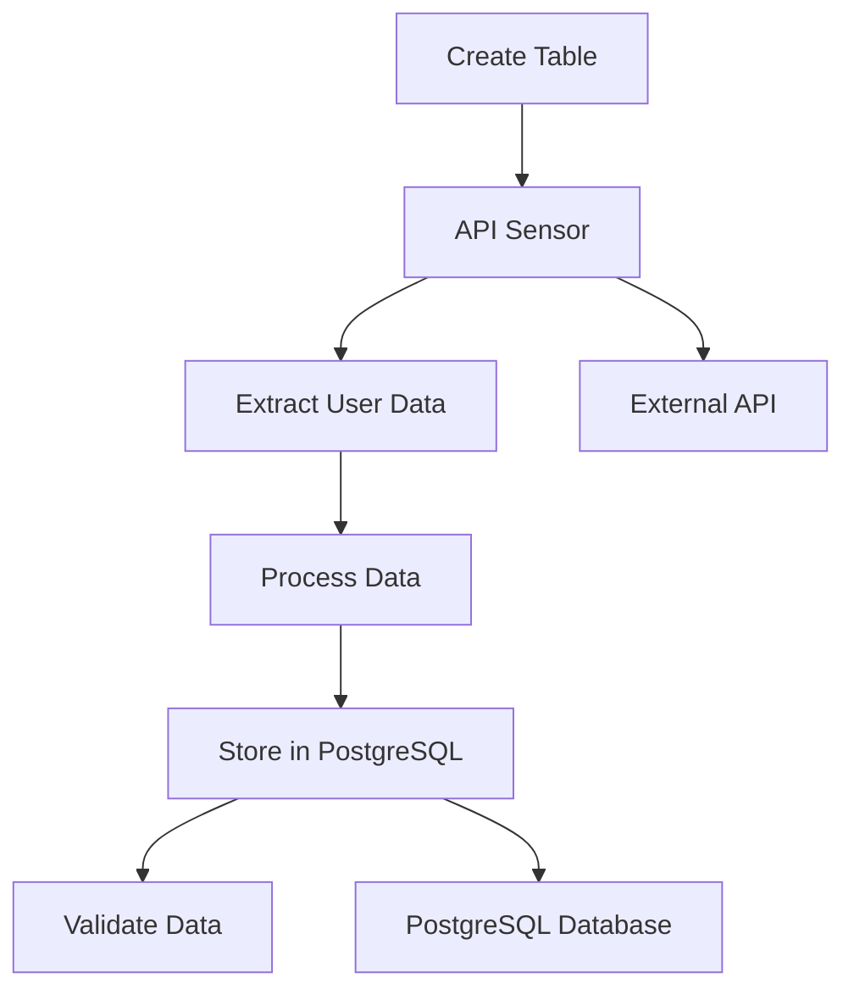

# 🚀 Airflow User Processing Pipeline

A complete data pipeline built with Apache Airflow that demonstrates ETL (Extract, Transform, Load) operations with API integration and PostgreSQL storage.

## 📋 Overview

This project showcases a production-ready Airflow DAG that:
- **Extracts** user data from an external API (Marc Lamberti's fakeuser dataset)
- **Transforms** the data into a standardized format
- **Loads** the processed data into PostgreSQL
- **Validates** the data integrity

## 🏗️ Architecture



## 🛠️ Features

- ✅ **Modern Airflow 3.0** with TaskFlow API
- ✅ **API Integration** with sensor-based availability checking
- ✅ **PostgreSQL Integration** with proper error handling
- ✅ **Data Validation** and integrity checks
- ✅ **Comprehensive Logging** and monitoring
- ✅ **Resource Management** with automatic cleanup
- ✅ **Retry Logic** and fault tolerance
- ✅ **Production-Ready** code with best practices

## 📁 Project Structure

```
airflow-intro/
├── dags/
│   └── user_processing.py          # Main DAG file
├── config/                         # Configuration files
├── logs/                          # Airflow logs
├── plugins/                       # Custom plugins
├── docker-compose.yaml            # Docker setup
└── README.md                      # This file
```

## 🚀 Quick Start

### Prerequisites

- Docker and Docker Compose
- Git

### Installation

1. **Clone the repository**
   ```bash
   git clone <your-repo-url>
   cd airflow-intro
   ```

2. **Start the services**
   ```bash
   docker-compose up -d
   ```

3. **Access Airflow UI**
   - URL: http://localhost:8080
   - Username: `admin`
   - Password: Get from logs with `docker-compose logs airflow-apiserver | grep "Password for user"`
   - Example: `Simple auth manager | Password for user 'admin': dftBt3cb6sMkn4df`

4. **Trigger the DAG**
   - Go to the Airflow UI
   - Find the `user_processing` DAG
   - Click the play button to trigger it manually

## 📊 DAG Details

### Tasks

| Task | Description | Type |
|------|-------------|------|
| `create_table` | Creates PostgreSQL table with proper schema | SQLExecuteQueryOperator |
| `is_api_available` | Sensor that checks API availability | TaskSensor |
| `extract_user` | Extracts and transforms user data | Python Task |
| `process_user` | Creates CSV file for batch processing | Python Task |
| `store_user` | Loads data into PostgreSQL | Python Task |
| `validate_data` | Validates data integrity | Python Task |

### Configuration

- **Schedule**: Daily at midnight
- **Retries**: 2 attempts with 5-minute delay
- **Timeout**: 5 minutes for API sensor
- **Max Active Runs**: 1

## 🔧 Configuration

### Environment Variables

The following environment variables are configured in `docker-compose.yaml`:

```yaml
AIRFLOW__CORE__DAGS_ARE_PAUSED_AT_CREATION: 'true'
AIRFLOW__CORE__LOAD_EXAMPLES: 'false'
AIRFLOW__WEBSERVER__AUTHENTICATE: 'false'  # Disabled for development
```

### Database Connection

The DAG uses a PostgreSQL connection with ID `postgres_conn`. The connection details are configured in the Docker Compose setup.

## 📈 Monitoring and Logs

### View Logs

```bash
# View all logs
docker-compose logs

# View specific service logs
docker-compose logs airflow-apiserver
docker-compose logs postgres
```

### Monitor DAG Execution

1. **Airflow UI**: http://localhost:8080
2. **CLI Commands**:
   ```bash
   # List DAGs
   docker-compose exec airflow-apiserver airflow dags list
   
   # Check DAG status
   docker-compose exec airflow-apiserver airflow dags state user_processing
   
   # View task logs
   docker-compose exec airflow-apiserver airflow tasks logs user_processing extract_user 2025-01-01
   ```

## 🧪 Testing

### Test Individual Tasks

```bash
# Test a specific task
docker-compose exec airflow-apiserver airflow tasks test user_processing extract_user 2025-01-01

# Test the entire DAG
docker-compose exec airflow-apiserver airflow dags test user_processing 2025-01-01
```

### Manual DAG Trigger

```bash
# Trigger DAG manually
docker-compose exec airflow-apiserver airflow dags trigger user_processing
```

## 🔍 Troubleshooting

### Common Issues

1. **DAG not visible in UI**
   ```bash
   docker-compose exec airflow-apiserver airflow dags reserialize
   docker-compose restart airflow-apiserver
   ```

2. **Database connection issues**
   ```bash
   docker-compose logs postgres
   docker-compose restart postgres
   ```

3. **API timeout errors**
   - Check internet connectivity
   - Verify API endpoint is accessible
   - Increase sensor timeout if needed

### Debug Mode

Enable debug logging by setting:
```yaml
AIRFLOW__LOGGING__LOGGING_LEVEL: 'DEBUG'
```

## 🏆 Best Practices Implemented

- ✅ **Error Handling**: Comprehensive try-catch blocks with specific exception types
- ✅ **Logging**: Structured logging with appropriate levels
- ✅ **Resource Management**: Automatic cleanup of temporary files
- ✅ **Data Validation**: Post-processing validation checks
- ✅ **Documentation**: Inline documentation and docstrings
- ✅ **Configuration**: Centralized configuration management
- ✅ **Retry Logic**: Configurable retry attempts with delays
- ✅ **Security**: Proper parameterized queries to prevent SQL injection

## 📚 Learning Resources

- [Apache Airflow Documentation](https://airflow.apache.org/docs/)
- [Airflow TaskFlow API](https://airflow.apache.org/docs/apache-airflow/stable/tutorial/taskflow.html)
- [PostgreSQL with Airflow](https://airflow.apache.org/docs/apache-airflow-providers-postgres/stable/index.html)

## 🤝 Contributing

1. Fork the repository
2. Create a feature branch
3. Make your changes
4. Add tests if applicable
5. Submit a pull request


## 🎯 POC Project

This is a **Proof of Concept** project demonstrating:
- Modern Airflow 3.0 TaskFlow API
- API integration with external data sources
- PostgreSQL database operations
- Docker containerization
- Production-ready code structure

**Built by:** Mousami Soni - Data Science Enthusiast specializing in Python, Airflow, Machine Learning, and AI technologies.

## 🙏 Acknowledgments

- **Marc Lamberti** - Udemy instructor for the excellent Airflow course and providing the fakeuser dataset
- Apache Airflow community
- PostgreSQL team
- Docker team

---

⭐ **Star this repository if you found it helpful!**

